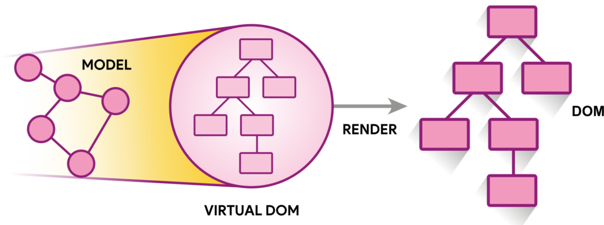
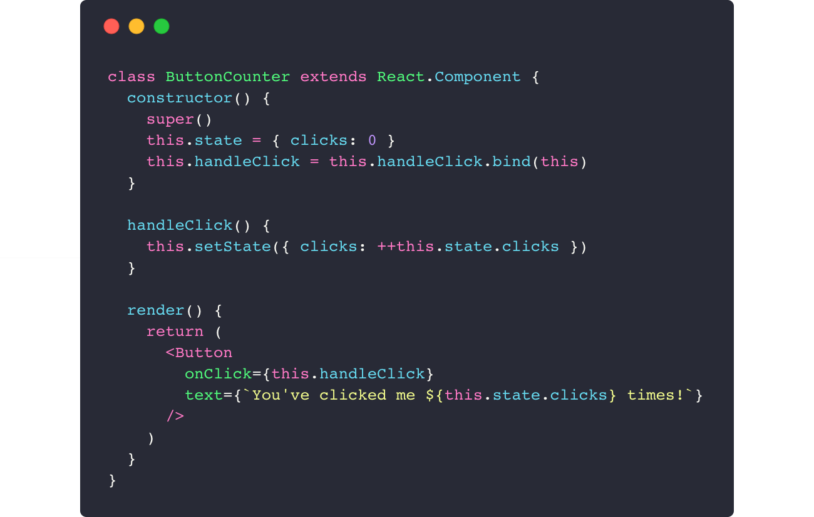
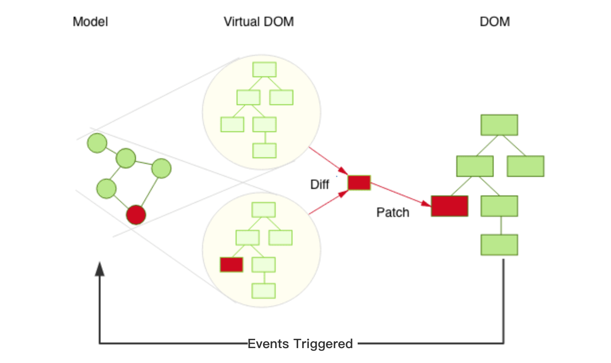
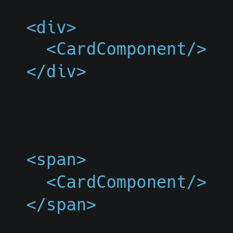
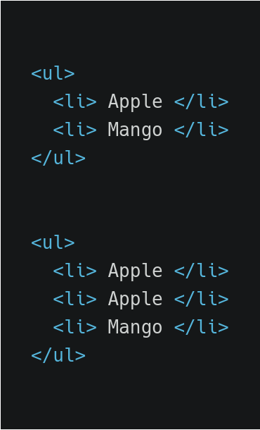
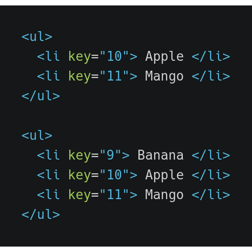

## Virtual DOM

---

### Topics

- [What is VDOM](#what-is-vdom?)
- [Rendering the Virtual DOM tree](#rendering-the-virtual-dom-tree)
- [Example](#example)
- [How does it actually work](#how-does-it-actually-work?)
- [Diffing or Reconciliation Algorithm](#diffing-or-reconciliation-algorithm)

---

### What is VDOM?

- Lightweight representation of the actual DOM.
- It’s just a tree data structure of plain javascript objects.
- Exists in-memory and never actually rendered

[Go to Index](#topics)

Note: Virtual DOm is basically a node tree that lists all the elements, attributes and its content in terms objects and properties

---

### Rendering the Virtual DOM tree

- Template language(JSX) tells the template compiler how to build an in-memory dom tree
- Render() creates the VDOM tree of react elements

[Go to Index](#topics)

---

### Example

https://babeljs.io/en/repl

[Go to Index](#topics)

---

### How does it actually work?

[Go to Index](#topics)

Note: So how does virtual DOM helps in doing fast DOM maipulations???

At any point in time react has two virtual dom tree representation in memory. One is the old one, the other is the new one after applying changes. It basically then creates a diff between the two DOM trees, and applies that differential patch to the Real DOM

---

### Diffing or Reconciliation Algorithm

- Finding minimum number of modifications is an O(n3) complexity Problem
- But react applies some heuristics and brings it to O(N) complexity problem
- How ??? It does this on two assumption

---

### Assumption 1

- Two elements of different types will produce different trees i.e. React will not diff them but replace them completely.

Note: Example on the next slide

---

Example

---

- It uses Breadth First Traversal

---

### Assumption 2

Child elements can be marked as stable during renders by passing _**key**_ to the element

---

---

---

### Thinking in React

---

